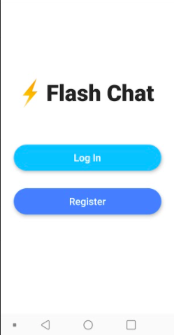
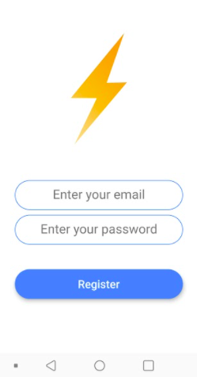
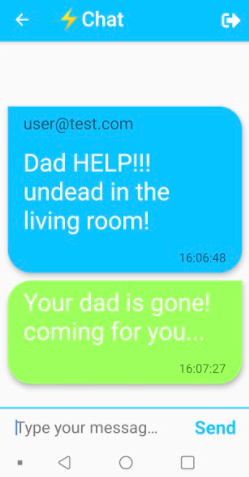

# Flash Chat ⚡️ - Educational Flutter App

Flash Chat is an educational public group chat app that allows users to register (freely), login and chat with the entire group in realtime. 

The chat room itself is text-only and displays the logged in user messages in a different style than the rest of the users.

Flash Chat utilizes Firebase Firestore as a serverless backend. 





## To build in debug mode

* Register a Firebase app
* Create an Android+iOS app in Firebase console and define your own app id in each. Download their settings files and place them in 'android/app/google-services.json' for Android and 'ios/GoogleService-Info.plist' for iOS. 
* Set your own app id throughout the code. Search and replace 'com.tailorvj.flash_chat' to 'com.yourname.flash_chat'. 
* If you are running on a Mac, open iOS/Runner.xcodeproj (xcode) and set app id in Runner + set legacy build system. 
* Build your own Android keys for APK publishing. 
* Start your emulator or connect a real device. 

```bash
$ flutter run
```

## iOS specific issues

* You have to install cocoapods before building
* It can be hell, sorry but that's Apple

## Subjects covered in this educational app

- How to incorporate Firebase into your Flutter projects.
- How to use Firebase authentication to register and sign in users.
- How to create beautiful animations using the Flutter Hero widget.
- How to create custom aniamtions using Flutter's animation controller. 
- Mixins and how they differ from superclasses.
- Streams.
- Use ListViews to build scrolling views.
- Use Firebase Cloud Firestore to store and retrieve data on the fly.

This app was created during the final module of London App Brewery's Flutter Development Bootcamp course. 

## License - GPLv3

All rights reserved to Asaf Prihadash @tailorvj